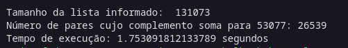

# Trabalho 01 - Soma Perfeita

- [Trabalho 01 - Soma Perfeita](#trabalho-01---soma-perfeita)
  - [Importante:](#importante)
  - [Enunciado do Problema:](#enunciado-do-problema)
  - [Resolução](#resolução)
    - [Detalhes sobre a geração Randômica de elementos com base no tamanho da lista](#detalhes-sobre-a-geração-randômica-de-elementos-com-base-no-tamanho-da-lista)
    - [Solução 01 - Merge Sort com Duplo Ponteiro](#solução-01---merge-sort-com-duplo-ponteiro)
    - [Solução 02 - Tabela Hash](#solução-02---tabela-hash)
    - [Solução 03 - Arvore Binária](#solução-03---arvore-binária)
    - [Rodando os Scripts](#rodando-os-scripts)
      - [Exemplo de saída:](#exemplo-de-saída)

## Importante:
- Não olhe códigos de outros ou da internet. Exceto os que são fornecidos. Também
não mostre ou publique o seu.
- Em caso de plágio, fraude ou tentativa de burlar os sistemas será aplicado nota 0 na
disciplina aos envolvidos.
- Alguns alunos podem ser solicitados para explicar com detalhes a implementação.
- Passar em todos os testes não é garantia de tirar a nota máxima. Sua nota ainda
depende do cumprimento das especificações do trabalho, qualidade do código,
clareza dos comentários, boas práticas de programação e entendimento da matéria
demonstrada em possível reunião.


## Enunciado do Problema: 

Considere o seguinte problema, seja 𝑆 ⊂ ℕ , e 𝑘 ∈ ℕ, encontrar quantos pares
{ 𝑖, 𝑗 } : 𝑖,   𝑗 ∈ 𝑆, 𝑖 ≠ 𝑗    e 𝑖 + 𝑗 = 𝑘, existem em 𝑆.

Um programador implementou o seguinte código para sortear 𝑆 e resolver o problema:

```python
import random

tamanho = int(input())
random.seed(tamanho)
l = []

while len(l) < tamanho:
    num = random.randint(0, 2**17)
    if num not in l:
        l.append(num)

alvo = random.randint(0, 2**17)

while alvo % 2 == 0:
    alvo = random.randint(0, 2**17)

contador = 0

for i in l:
    compl = alvo - i
    if compl in l:
        contador = contador + 1
print(int(contador/2))
```

Entretanto o código feito é bastante ineficiente, nesse trabalho você deverá entender o
porque esse código é ineficiente e desenvolver 3 alternativas (ainda em Python) para
melhorá-lo, chegando ao mesmo resultado. Sujeito às seguintes restrições:

1. Uma das alternativas obrigatoriamente deve usar **Tabela Hash** implementada por
você.
2. Você não deve usar bibliotecas muito elaboradas (ex: NumPy, itertools, etc). Em
caso de dúvida se algo pode ser utilizado consulte o professor.
3. Suas alternativas devem seguir ideias diferentes (e não apenas implementações
diferentes da mesma ideia.)


## Resolução 

### Detalhes sobre a geração Randômica de elementos com base no tamanho da lista

Vale ressaltar que ao gerar números aleatórios com ```num = random.randint(0, 2**17)```, os números gerados estarão no intervalo entre 0 e 2¹⁷, ou seja, entre 0 e 131072 (inclusive). Isso significa que o número máximo de valores únicos que podem ser gerados é 131073 (incluindo zero).

Se o tamanho da lista (size) for maior que 131073, o programa entrará em um loop infinito ao tentar adicionar elementos únicos a um conjunto (set). Isso acontece porque, após gerar todos os números possíveis no intervalo, não haverá novos números únicos disponíveis para serem adicionados.

Portanto, para garantir que o programa funcione corretamente, o tamanho da lista (size) não deve exceder 2¹⁷ + 1. Em outras palavras, o caso extremo para testar o programa é quando a lista contém até 131073 elementos.


### Solução 01 - Merge Sort com Duplo Ponteiro

O código ```MergeSort.py``` utiliza o algoritmo de ordenação Merge Sort, que divide recursivamente a lista ao meio até que cada subdivisão contenha apenas um elemento. Em seguida, mescla essas subdivisões ordenadas em uma única lista ordenada. Em seguida, foi implementada uma função para encontrar pares na lista ordenada cuja soma é igual a um valor alvo específico, usando uma abordagem de ponteiros para percorrer a lista de forma eficiente.


### Solução 02 - Tabela Hash

O código ```HashTable.py``` contém uma tabela hash desenvolvido com uma classe chamada HashTable. Ela contém as seguintes propriedades:

- | **self.size** : é o tamanho da tabela hash
- | **self.slots** : são os slots que serão inizializados com base no tamanho da hash table fornecido. Cada Slot contém uma lista vazia que será utilizada para adicionar elementos. 
- | **self.count** : é o contador de elementos que já foram inseridos na tabela hash.

Os métodos utilizados nessa implementação foram:

- | ``def _hash``: é o método para calcular o valor de hash com base no tamanho da tabela hash.
  
- | ``def put``: é o método para adicionar os elementos na tabela hash, o qual primeiro é calculado o hash_key e em seguida verificado se o valor está na tabela hash. Se não estiver, é adicionado, assim a função permite que somente valores diferentes estejam na tabela hash.

- | ``def contains``: é o método para  verificar se o elemento está contido na tabela hash.


### Solução 03 - Arvore Binária

### Rodando os Scripts

Para que consiga rodar cada script primeiro selecione a pasta em que se encontra o script:

```bash
cd resposta-hash-table
```

Para rodar o script com a possibilidade de colocar o input do tamanho da lista, entre com:
```bash
python HashTable.py
```

Para rodar o script com um número do tamanho da lista pré-setado digite (lembre-se de alterar o arquivo `tamanho-lista.txt` com o tamanho desejado):

```bash
time python HashTable.py < ../tamanho-lista.txt
```


#### Exemplo de saída:

